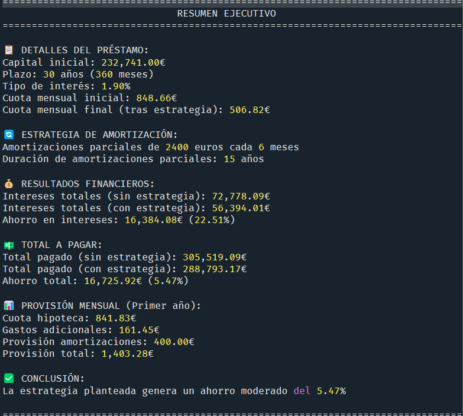

# SimuladorHipoteca

Herramienta avanzada de simulación y optimización de estrategias de amortización hipotecaria que permite evaluar diferentes escenarios de pago para maximizar el ahorro financiero.


## Motivación

La amortización hipotecaria es una de las decisiones financieras más importantes en la vida de muchas personas. Este proyecto nace de la necesidad de:

- Analizar cuantitativamente diferentes estrategias de amortización
- Evaluar el impacto a largo plazo de amortizaciones extraordinarias
- Optimizar la distribución de recursos financieros entre cuotas, amortizaciones y gastos asociados
- Encontrar el mejor equilibrio entre esfuerzo económico y beneficio en ahorro

## Características principales

El simulador incorpora dos clases fundamentales:

### HipotecaSimulator

Permite simular una estrategia concreta de amortización con las siguientes funcionalidades:

- Cálculo de cuadros de amortización estándar y con estrategia personalizada
- Análisis de distribución de intereses a lo largo de la vida del préstamo
- Gestión y proyección de gastos adicionales (comunidad, seguros, etc.)
- Cálculo detallado del ahorro generado por la estrategia elegida
- Visualización gráfica de resultados con comparativas detalladas
- Generación de informes y resúmenes ejecutivos

### HipotecaGridSearch

Implementa una búsqueda sistemática en rejilla para encontrar la estrategia óptima:

- Exploración exhaustiva de combinaciones de parámetros
- Comparación de múltiples estrategias según diferentes criterios
- Identificación automática de las mejores estrategias según ahorro total, porcentaje, cuota final, etc.
- Visualización comparativa de resultados entre estrategias

## Requisitos

El sistema requiere Python 3.7+ y las siguientes dependencias:

```
numpy
pandas
matplotlib
tqdm
dateutil
```

## Instalación

1. Clonar el repositorio:

```bash
git clone https://github.com/backmind/SimuladorHipoteca.git
cd SimuladorHipoteca
```

2. Instalar dependencias:

```bash
pip install -r requirements.txt
```

## Uso básico

Este es un script muy básico que he montado para mí mismo. No está modularizado, no se puede importar como paquete python, ni tampoco tiene una interfaz CLI para ejecutarlo desde consola. Todo esta queda como TODO. Así que para ejecutarlo hay que abrir el script en cualquier editor, modificar las partes interesantes referentes a la estrategia o al gridsearch para la mejor estrategia.

### Simular una estrategia específica

Para crear una estrategia específica es tan fácil como instanciar un objeto HipotecaSimulator con las características de la hipoteca a simular. Después le puedes añadir los gastos mensuales que consideres oportuno mediante el método `.agregar_gasto_mensual`, al que le tienes que poner un nombre del gasto, una cuantía, un incremento anual y si es mensualizado o no (por defeco se consideran gastos mensualizados)

```python
# Crear simulador con parámetros básicos
sim = HipotecaSimulator(
    capital_inicial=250000,
    plazo_años=30,
    tasa_interes_anual=2.5,
    amortizacion_inicial=10000,
    amortizacion_semestral_tipo='constante',
    amortizacion_semestral_valor=1800,
    años_amortizacion_parcial=10,
    fecha_inicio='2025-06-01'
)

# Agregar gastos mensuales
sim.agregar_gasto_mensual("Comunidad", 50.0, 3.0)  # 3% de incremento anual
sim.agregar_gasto_mensual("IBI", 300, 2.0, mensualizado=False)  # 2% de incremento anual
sim.agregar_gasto_mensual("Seguro Hogar", 550, 5.0, mensualizado=False)  # 5% de incremento anual

# Analizar la distribución de intereses
sim.analizar_distribucion_intereses()

# Generar informe completo
df_estandar, df_estrategia, df_gastos, ahorro = sim.generar_informe()

# Visualizar resultados
sim.visualizar_resultados()

# Mostrar resumen ejecutivo
sim.resumen_ejecutivo()
```



### Buscar la estrategia óptima

Otra opción que da este script es dar una rejilla de parámetros para que busque en todas las combinaciones posibles y muestre las más rentables. Para ello se instancia un objeto de rejilla con los gastos adicionales asociados y se establece mediante el método `configurar_grid` el espacio de parámetros a recorrer.

```python

# Crear buscador con parámetros básicos
grid = HipotecaGridSearch(
    capital_inicial=250000,
    plazo_años=30,
    tasa_interes_anual=2.5,
    fecha_inicio='2025-06-01',
    gastos_mensuales={"Comunidad": 50.0, "IBI": 25.0, "Seguro Hogar": 45.83},
    tasas_incremento={"Comunidad": 3.0, "IBI": 2.0, "Seguro Hogar": 5.0}
)

# Configurar espacio de búsqueda
grid.configurar_grid(
    amortizacion_inicial_valores=[0, 10000, 20000],
    amortizacion_tipos=['cuotas', 'constante'],
    amortizacion_valores={
        'cuotas': [2, 3, 4],
        'constante': [1000, 1800, 2400]
    },
    años_amortizacion_valores=[5, 10, 15]
)

# Ejecutar búsqueda
grid.ejecutar_grid(progreso=True)

# Ver resumen de las mejores estrategias
grid.resumen_top_estrategias(n=5)

# Visualizar comparativa de estrategias
grid.visualizar_comparativa(criterio='ahorro_total', top_n=5)

# Obtener y analizar la mejor estrategia
mejor_simulador = grid.obtener_mejor_estrategia(criterio='ahorro_total')
mejor_simulador.resumen_ejecutivo()
```


## Explicación de parámetros clave

### Parámetros del simulador

- **capital_inicial**: Capital principal del préstamo en euros
- **plazo_años**: Duración total del préstamo en años
- **tasa_interes_anual**: Tipo de interés anual en porcentaje (p. ej. 2.5 para 2,5%)
- **amortizacion_inicial**: Importe de amortización inicial (en el momento de la firma)
- **amortizacion_semestral_tipo**: Método de amortización semestral
  - `'cuotas'`: Equivalente a un número de cuotas mensuales
  - `'constante'`: Importe fijo en euros
- **amortizacion_semestral_valor**: Cantidad de cuotas o importe en euros (según el tipo)
- **años_amortizacion_parcial**: Duración en años del periodo de amortizaciones parciales

### Criterios de optimización

- **ahorro_total**: Ahorro absoluto en euros
- **ahorro_porcentaje**: Porcentaje de ahorro respecto al coste total estándar
- **cuota_final**: Cuota mensual resultante tras las amortizaciones
- **provision_mensual**: Importe mensual promedio necesario (cuota + gastos + ahorro para amortizaciones)
- **relacion_ahorro_provision**: Ratio entre ahorro total y esfuerzo mensual

## Interpretación de resultados

El simulador proporciona visualizaciones y métricas para comprender:


1. **Evolución del capital pendiente**: Muestra la reducción del principal a lo largo del tiempo
2. **Comparativa de cuotas**: Analiza la evolución de la cuota mensual
3. **Desglose de gastos**: Visualiza todos los gastos asociados a la hipoteca
4. **Ahorro total**: Cuantifica el ahorro total y porcentual de la estrategia

El resumen ejecutivo proporciona una síntesis de la estrategia con métricas clave como:
- Ahorro total en euros y porcentaje
- Cuota inicial y final
- Provisión mensual recomendada
- Distribución de intereses

## Casos de uso recomendados

Este simulador es especialmente útil para:

- **Compradores de vivienda**: Evaluar diferentes estrategias antes de firmar la hipoteca
- **Propietarios con hipoteca vigente**: Optimizar los recursos disponibles para amortizaciones extraordinarias
- **Asesores financieros**: Proporcionar recomendaciones personalizadas y fundamentadas
- **Analistas inmobiliarios**: Estudiar escenarios de financiación en proyectos de inversión

## Análisis de distribución de intereses

Una funcionalidad clave del simulador es el análisis de la distribución de intereses a lo largo de la vida del préstamo, lo que permite identificar el periodo óptimo para realizar amortizaciones extraordinarias.


Este análisis muestra cómo se concentran los intereses en los primeros años del préstamo, destacando los puntos donde se alcanza el 50% y el 80% del total de intereses. Esta información es fundamental para determinar el periodo más efectivo para realizar amortizaciones extraordinarias.

## Consideraciones técnicas

- El simulador utiliza el sistema francés de amortización (cuota constante)
- Los cálculos se realizan con precisión mensual
- Las amortizaciones extraordinarias se aplican siguiendo la estrategia de reducir cuota (manteniendo plazo)
- Las proyecciones de gastos incorporan tasas de incremento anual compuesto

## Contribuciones

Las contribuciones son bienvenidas. Para contribuir:

1. Haz un fork del repositorio
2. Crea una rama para tu característica (`git checkout -b feature/nueva-caracteristica`)
3. Realiza tus cambios y haz commit (`git commit -m 'Añade nueva característica'`)
4. Haz push a la rama (`git push origin feature/nueva-caracteristica`)
5. Abre un Pull Request

## Licencia

Este proyecto está licenciado bajo [MIT License](LICENSE).

## Estructura modular

El proyecto está diseñado con una arquitectura modular que permite utilizar sus componentes de forma independiente según las necesidades del usuario:

### Uso independiente de HipotecaSimulator

Si solo necesitas simular y analizar una estrategia específica de amortización sin realizar búsquedas comparativas, puedes utilizar únicamente la clase `HipotecaSimulator`. Esto es ideal para:

- Análisis de una estrategia hipotecaria concreta
- Integración en otros sistemas o aplicaciones financieras
- Evaluación rápida de un escenario específico
- Uso educativo para entender el impacto de amortizaciones extraordinarias

### Uso completo con GridSearch

Para análisis comparativos y optimización de estrategias, utiliza la funcionalidad completa que incluye `HipotecaGridSearch`:

La carpeta `/examples` contiene ejemplos específicos para cada caso de uso, desde el más básico hasta búsquedas avanzadas con múltiples parámetros.

## Créditos

- Yasser 'hda' Fuentes

Desarrollado como herramienta de análisis financiero personal para la toma de decisiones informadas en inversiones inmobiliarias.
